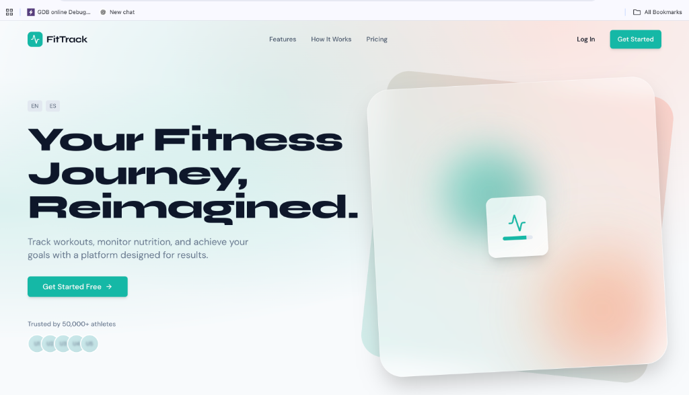
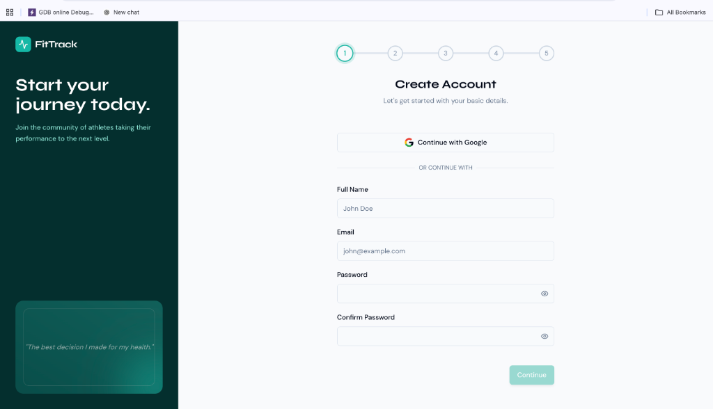
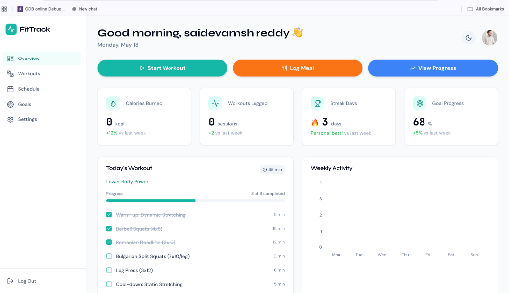

# FitTrack

A premium fitness and wellness SaaS platform built with modern web technologies.

## Tech Stack

| Technology | Description |
|---|---|
| **React 18** | UI Library |
| **Vite** | Build Tool |
| **Tailwind CSS** | Styling & Utility Classes |
| **Shadcn/UI** | Accessible UI Primitives |
| **Framer Motion** | Complex Animations & Transitions |
| **Zustand** | Global State Management (Auth, Theme) |
| **React Hook Form + Zod** | Form Validation |
| **Lucide React** | Icons |
| **Recharts** | Data Visualization |
| **Canvas Confetti** | Celebration Effects |

## Design Decisions

- **Color Palette**: A vibrant and energetic "Teal" (`#14b8a6`) serves as the primary brand color, conveying health and progress. A warm "Coral" (`#FF5C38`) acts as an accent color for critical CTAs, creating high contrast.
- **Typography**: `Syne` is used for bold, impactful headings to give a premium, modern feel. `DM Sans` is used for body text to ensure maximum readability. `JetBrains Mono` is used for data points (stats, calories) to give a precise, technical aesthetic.
- **Dark Mode**: Fully supported via a custom `data-theme` attribute and Tailwind CSS variables. The dark mode uses deep navy/neutral tones (`#0a0a0a`) rather than pure black to reduce eye strain.
- **Animations**: Framer Motion is used strategically:
  - Page transitions (`AnimatePresence`) for a native app feel.
  - Scroll reveals on the landing page to keep the user engaged.
  - Micro-interactions (hover, tap) on cards and buttons.
  - A confetti burst upon successful profile setup to reward the user.

## Project Structure

```
src/
├── components/
│   ├── ui/           # Shadcn components (Button, Input, Card, etc.)
│   ├── landing/      # Landing page sections (Hero, Features, Pricing, etc.)
│   ├── auth/         # Multi-step authentication flow components
│   └── dashboard/    # Dashboard layout and widgets (Sidebar, Charts, etc.)
├── pages/            # Top-level route components
├── store/            # Zustand stores
├── lib/              # Utilities and Zod validation schemas
└── hooks/            # Custom React hooks
```

## Setup Instructions

1. Ensure you have Node.js installed.
2. Install dependencies:
   ```bash
   npm install
   ```
3. Run the development server:
   ```bash
   npm run dev
   ```

## Live Demo
[https://fit-track-gru4.vercel.app/](https://fit-track-gru4.vercel.app/)

## Screenshots

### Landing Page


### Authentication Flow (Multi-step)


### User Dashboard



## Component Documentation & Architecture

FitTrack follows a feature-driven component architecture. Components are kept small, focused, and grouped by domain (`auth/`, `landing/`, `dashboard/`).

### Reusable Patterns:
1. **Design System Primitives**: All base UI elements (Buttons, Inputs, Cards) are centrally managed in `src/components/ui/` using Shadcn principles. They accept `className` props and merge styles using `tailwind-merge` (`cn` utility), ensuring they can be customized without breaking base styles.
2. **State Management**: Complex multi-step state (Auth flow) and global UI state (Theme) are decoupled from components using Zustand stores (`useAuthStore`, `useThemeStore`). This prevents prop drilling.
3. **Form Handling**: Real-time validation is standardized across the app using `react-hook-form` paired with Zod schemas defined in `src/lib/validations.js`.
4. **Motion Wrapping**: Animation primitives from Framer Motion are encapsulated within components to maintain clean JSX. The `AnimatePresence` wrapper is used at the routing layer to enable smooth page transitions between major sections.
